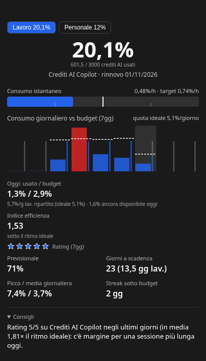

🌐 [English](README.md) | **Italiano**

# IA Hypermiler

Un piccolo widget sempre in primo piano, per Windows, macOS e Linux, che ti dice a che ritmo stai usando le quote di **Claude** e **GitHub Copilot** e quanto puoi ancora usare oggi perché la quota arrivi al rinnovo.

Dati di esempio, non un account reale.

- **Più account**, Claude e Copilot in qualsiasi combinazione (per esempio un account Claude personale e una licenza Copilot aziendale), ognuno con la sua sessione.
- **I tuoi giorni lavorativi**: ogni account può seguire un suo orario (giornata intera, mezza o libera per ogni giorno della settimana), così i weekend non contano come tempo in cui avresti potuto usare la quota.
- **Un budget per oggi**, ricalcolato ogni mattina da quanto resta.
- **Notifiche** quando una quota supera la tua soglia di allarme, o quando il consumo di oggi va molto oltre il budget di oggi.
- Interfaccia in italiano e inglese.

> Progetto personale in sviluppo attivo. Le versioni sono pre-release (`v0.x-beta`).

---

## Installazione

Scarica il pacchetto per il tuo sistema da [Releases](https://github.com/suppressio/ia-hypermiler/releases): `.exe` (Windows), `.dmg` (macOS), `.AppImage` o `.deb` (Linux).

I pacchetti non sono firmati: Windows SmartScreen e macOS Gatekeeper mostrano un avviso la prima volta. L'app controlla le nuove versioni all'avvio e ogni 24 ore e apre nel browser il download giusto.

## Primo avvio

1. Apri **Impostazioni** (⚙ nel widget, o dall'icona nel tray) → **Aggiungi account**.
2. **Claude**: *Connetti…* apre il login di claude.ai (email e password o SSO aziendale) in una finestra dedicata. L'app non ti chiede mai di incollare un cookie.
   **GitHub Copilot**: incolla un Personal Access Token (fine-grained con *Plan* in sola lettura, o classic senza scope), oppure accedi con una GitHub OAuth App. Per una licenza aziendale su un tenant `<nome>.ghe.com`, imposta prima il dominio GitHub.
3. Facoltativo, per ogni account: il **calendario di lavoro** (ultima sezione dell'account) e, solo se il provider non lo comunica, il **giorno di rinnovo**.

Chiudendo il widget l'app resta nel tray; *Esci* è nel menu del tray.

---

## Come leggere il widget

Tutti i valori qui sotto riguardano la finestra di quota mostrata, di solito quella che richiede più attenzione. Con più account c'è una scheda per account; con più finestre di quota (per esempio il limite di 5 ore e quello settimanale di Claude) una lista sopra il valore principale le mostra tutte con un breve verdetto. Clicca una riga per vedere quella finestra.

### Il verdetto di ogni finestra

Si basa sulla quota che resta **adesso**, ripartita sui giorni lavorativi fino al reset, confrontata con una ripartizione uniforme di tutto il periodo:

| Verdetto | Significato |
|---|---|
| **in linea** | entro ±5% della ripartizione uniforme |
| **margine** | hai usato meno del previsto: hai più quota al giorno a disposizione |
| **quota ridotta** | hai usato più del previsto: resta meno quota al giorno |
| **a rischio** | resta meno di metà della ripartizione uniforme al giorno, oppure al ritmo attuale finiresti prima del reset |

### Valore principale

La percentuale di quota usata e, sotto, il valore assoluto quando il provider lo fornisce (per esempio i crediti AI di Copilot, il credito extra di Claude in USD) e la data di rinnovo.

### Consumo istantaneo

A che velocità stai usando la quota in questo momento, in % della quota all'ora.

- **Come si calcola**: quanto è salito il consumo nell'ultima ora circa di letture. Mentre il consumo sale l'app interroga il provider ogni 5 minuti, altrimenti all'intervallo scelto nelle Impostazioni (30 minuti di default).
- **Target** (la tacca bianca): il ritmo che ti porterebbe esattamente al 100% al reset, ripartito sulle ore lavorative rimaste.
- **Come leggerlo**: la tacca è sempre a metà. Le tacche leggere segnano metà del target (a sinistra) e il doppio (a destra), e l'estremità destra vale quattro volte il target o più. La barra diventa rossa sopra il target. Un picco breve va bene; una barra rossa per ore è il segnale da tenere d'occhio.

### Consumo giornaliero vs budget

Uno spazio per giorno: gli ultimi 7 o 30 giorni (Impostazioni → Intervallo grafico), poi i prossimi 2 o 5. Oggi è lo spazio con lo sfondo chiaro.

- **Barra larga**: quanto hai usato quel giorno. Rossa se ha superato il budget di quel giorno.
- **Barretta sottile accanto**: la ripartizione uniforme di una giornata lavorativa intera. La parte colorata è la quota lavorativa di quel giorno (tutta, o metà in una mezza giornata); la parte grigia è la quota che quel giorno non ha (tutta in un giorno libero).
- **Linea tratteggiata**, la parte che si muove:
  - su un giorno passato, il budget che avevi **quella mattina**;
  - oggi, il **budget di oggi**;
  - sui giorni a venire, quanto resta **ridistribuito** sui giorni lavorativi fino al reset.

  Una giornata pesante abbassa la linea dei giorni successivi; una leggera la alza.
- **Quota ideale** (in alto a destra): la ripartizione uniforme di una giornata lavorativa intera su tutto il periodo.

### Oggi: usato / budget

Quanto hai usato oggi rispetto al **budget di oggi**: quello che restava stamattina, diviso per i giorni lavorativi fino al reset (oggi compreso), per la quota di oggi (metà in una mezza giornata). Resta fisso per tutta la giornata.

Sotto: la quota che resta per giorno lavorativo da ora in poi, accanto a quella ideale, e quanto ti resta oggi o di quanto sei oltre.

### Indice di efficienza e rating

- **Indice di efficienza**: il ritmo ideale diviso per il tuo ritmo reale dall'inizio del periodo, sui giorni lavorativi. Sopra 1 stai usando meno del ritmo ideale, sotto 1 di più.
- **Stelle** (sull'intervallo del grafico): quanto ogni giorno è rimasto vicino alla sua quota ideale. 5 stelle: in media hai usato due terzi della quota o meno; 3 stelle: circa la quota; 1 stella: molto oltre.

### Previsionale

Dove arriveresti al reset continuando così: metà ritmo medio del periodo, metà ritmo degli ultimi tre giorni lavorativi completi. Può superare il 100%: serve proprio a vederlo.

### Giorni a scadenza

I giorni di calendario fino al reset e, tra parentesi, i giorni lavorativi secondo l'orario dell'account.

### Autonomia stimata

Per quanti giorni lavorativi basta la quota al ritmo attuale. **Compare solo se finiresti prima del reset**: altrimenti ripeterebbe soltanto il previsionale.

### Picco / media giornaliera

Il tuo giorno più pesante e la media tra i giorni completi dell'intervallo del grafico. Compare da due giorni completi in poi.

### Streak sotto budget

Giorni completi consecutivi, fino a ieri, rimasti entro il loro budget: gli stessi giorni che nel grafico non sono rossi. I giorni liberi senza consumo vengono saltati. Nascosto finché è 0.

### Consigli

Compaiono solo quando aggiungono qualcosa che i numeri sopra non dicono: finiresti prima del reset (e di quanto rallentare), un buon rating che lascia spazio a una sessione più lunga, una quota quasi esaurita vicino al reset, oppure (con gli insight locali) un legame tra i tuoi giorni più pesanti e i contesti molto lunghi.

### Colori

- **Valore principale e previsionale** diventano **arancioni** 5 punti sotto la tua soglia di allarme e **rossi** dalla soglia in su (Impostazioni → Notifiche, 80% di default).
- **Oggi: usato / budget** diventa **arancione** quando hai usato la soglia di allarme del budget di oggi (l'80% di default) e **rosso** solo quando lo superi.
- **Le barre del grafico** sono rosse quando quel giorno ha superato il suo budget (la linea tratteggiata).

### Insight locali (Claude Code, facoltativi)

Se li attivi su un account Claude, l'app legge le sessioni di Claude Code su questo computer (solo conteggi di token e nomi degli strumenti, mai il contenuto dei messaggi). Mostra quanti token ottieni per ogni 1% di quota, quanta parte viene da contesti molto lunghi (oltre 150k) o da sessioni molto lunghe, e gli strumenti più usati.

---

## Impostazioni

| Sezione | Cosa puoi impostare |
|---|---|
| **Account** | aggiungere, connettere, disconnettere (cancella la sessione salvata), attivare/disattivare; per account: nome, calendario di lavoro, giorno di rinnovo se il provider non lo comunica, metodo di login Claude e insight locali, dominio e autenticazione Copilot |
| **Aspetto** | lingua, stile della finestra (chiaro, scuro, trasparente), intervallo del grafico (7 o 30 giorni), intervallo di aggiornamento, colore d'accento |
| **Notifiche** | soglia di allarme (%), usata anche per i colori |
| **Aggiornamenti** | versione installata, controllo manuale e automatico; **Guida** apre questa pagina |
| **Diagnostica** | segnalazione automatica di un cambio di formato del provider; file di report di diagnosi |

## Notifiche

- **Soglia**: quando una quota supera la tua soglia di allarme, una volta al giorno per account.
- **Ritmo**: quando il consumo di oggi supera 1,5 volte il budget di oggi, una volta al giorno per account. Ti avvisa il giorno in cui le cose si mettono male, quando c'è ancora tempo per correggere.

## Privacy e sicurezza

- Sessioni e token sono salvati solo sul tuo computer, cifrati, e non vengono mai mostrati all'interfaccia né scritti nei log.
- L'app parla solo con i provider (claude.ai, l'API GitHub del tuo dominio) e con GitHub Releases per il controllo aggiornamenti. Nient'altro viene inviato altrove.
- **Segnalare un problema**: Impostazioni → Diagnostica → *Crea report di diagnosi* salva un file di testo in Download e apre una bozza di issue su GitHub. Il file **contiene** i tuoi valori di consumo (percentuali, importi, date di reset) ma nessun nome, id o credenziale. Le issue di questo repository sono **pubbliche**: leggi il file prima di allegarlo, oppure descrivi il problema senza.
- Se un provider cambia il formato delle risposte, si apre una bozza di issue precompilata con la sola struttura (nomi e tipi dei campi, mai i valori). Puoi disattivarla nelle Impostazioni.

---

## Sviluppo

Compilazione dai sorgenti, test, packaging e struttura del progetto sono in [DEVELOPMENT.it.md](DEVELOPMENT.it.md).

## Licenza

[MIT](./LICENSE) © 2026 Daniele 'suppressio'.
