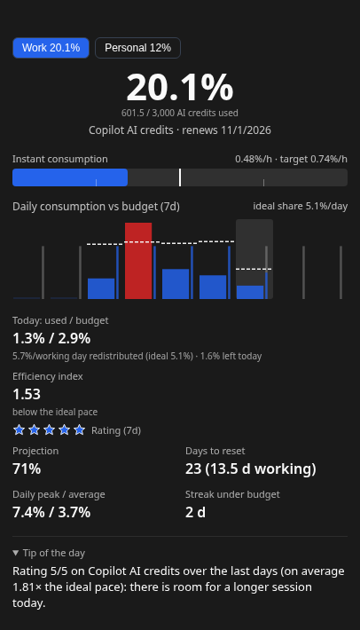

🌐 **English** | [Italiano](README.it.md)

# IA Hypermiler

A small always-on-top widget for Windows, macOS and Linux that tells you how fast you are using your **Claude** and **GitHub Copilot** quotas, and how much you can still use today so the quota lasts until it renews.

Example data, not a real account.

- **Several accounts**, any mix of Claude and Copilot (e.g. a personal Claude account and a company Copilot seat), each with its own session.
- **Your working days**: each account can follow its own schedule (full, half or day off per day of the week), so weekends do not count as time you could have spent the quota.
- **A budget for today**, recomputed every morning from what is left.
- **Notifications** when a quota passes your alert threshold, or when today's use goes well over today's budget.
- English and Italian interface.

> Personal project in active development. Releases are pre-releases (`v0.x-beta`).

---

## Install

Download the package for your system from [Releases](https://github.com/suppressio/ia-hypermiler/releases): `.exe` (Windows), `.dmg` (macOS), `.AppImage` or `.deb` (Linux).

The packages are not signed: Windows SmartScreen and macOS Gatekeeper show a warning the first time. The app checks for new versions at startup and every 24 hours and opens the right download in your browser.

## First start

1. Open **Settings** (⚙ in the widget, or from the tray icon) → **Add account**.
2. **Claude**: *Connect…* opens the claude.ai login (email/password or company SSO) in a window of its own. The app never asks you to paste a cookie.
   **GitHub Copilot**: paste a Personal Access Token (fine-grained, *Plan* read-only, or classic with no scope), or sign in with a GitHub OAuth App. For a company seat on a `<name>.ghe.com` tenant, set the GitHub domain first.
3. Optional, per account: the **work schedule** (last section of the account) and, only when the provider does not report it, the **renewal day**.

The widget stays in the tray when you close it; *Quit* is in the tray menu.

---

## Reading the widget

All the values below are about the quota window shown, usually the one needing attention most. With several accounts there is one tab per account; with several quota windows (e.g. Claude's 5-hour and weekly limits) a list above the main value shows each one with a short verdict. Click a row to see that window.

### The verdict on each window

From the quota left **now**, spread over the working days until the reset, compared with an even split of the whole period:

| Verdict | Meaning |
|---|---|
| **on track** | within ±5% of the even split |
| **room to spare** | you have used less than planned: more per day is available |
| **quota reduced** | you have used more than planned: less per day is left |
| **at risk** | less than half the even split is left per day, or your current pace would run out before the reset |

### Main value

Percentage of the quota used, and below it the absolute value when the provider gives one (e.g. Copilot AI credits, Claude extra credit in USD) and the renewal date.

### Instant consumption

How fast you are using the quota right now, in % of the quota per hour.

- **How it is computed**: the rise in usage over about the last hour of readings. While usage is rising the app reads the provider every 5 minutes, otherwise at the interval set in Settings (30 minutes by default).
- **Target** (the white marker): the pace that would bring you exactly to 100% at the reset, spread over the working hours left.
- **How to read it**: the marker is always in the middle. The faint ticks mark half the target (left) and twice the target (right), and the far right end is four times the target or more. The bar turns red above the target. A short burst is fine; a bar that stays red for hours is what to watch.

### Daily consumption vs budget

One slot per day: the last 7 or 30 days (Settings → Chart range), then the next 2 or 5 days. Today is the slot with a light background.

- **Wide bar**: what you used that day. Red when it went over that day's budget.
- **Thin bar beside it**: the even split of a full working day. The coloured part is that day's working share (all of it, half on a half day); the grey part is the share the day does not get (all of it on a day off).
- **Dashed line**, the part that moves:
  - on a past day, the budget you had **that morning**;
  - today, **today's budget**;
  - on the days to come, what is left **redistributed** over the working days until the reset.

  A heavy day lowers the line of the days after it; a light day raises it.
- **Ideal share** (top right): the even split of a full working day for the whole period.

### Today: used / budget

What you have used today against **today's budget**: what was left this morning, divided by the working days until the reset (today included), times today's share (half on a half day). It stays fixed for the day.

Below it: the quota left per working day from now on, next to the ideal one, and what is left today or how far over you are.

### Efficiency index and rating

- **Efficiency index**: the ideal pace divided by your actual pace since the start of the period, on working days. Above 1 you are using less than the ideal pace, below 1 more.
- **Stars** (over the chart range): how consistently each day stayed close to its ideal share. 5 stars: on average you used two thirds of the share or less; 3 stars: about the share; 1 star: well over it.

### Projection

Where usage would be at the reset if you keep going like this: half the average pace of the period, half the pace of the last three completed working days. It can go over 100%: that is the point.

### Days to reset

Calendar days until the reset, and in brackets the working days according to the account's schedule.

### Estimated autonomy

How many working days the quota lasts at the current pace. **Shown only when it runs out before the reset**: otherwise it would only repeat the projection.

### Daily peak / average

Your heaviest day and your average day among the completed days of the chart range. Shown from two completed days on.

### Streak under budget

Consecutive completed days, up to yesterday, that stayed within their budget: the same days that are not red in the chart. Days off with no use are skipped. Hidden while it is 0.

### Tip of the day

Shown only when it adds something the numbers above do not say: you would run out before the reset (and by how much to slow down), a good rating that leaves room for a longer session, a quota almost used up close to the reset, or (with local insights) a link between your heaviest days and very long contexts.

### Colours

- **Main value and projection** turn **orange** 5 points below your alert threshold and **red** from the threshold on (Settings → Notifications, 80% by default).
- **Today: used / budget** turns **orange** once you have used the alert threshold of today's budget (80% of it by default) and **red** only when you go over it.
- **Chart bars** are red when that day went over its budget (the dashed line).

### Local insights (Claude Code, optional)

When enabled on one Claude account, the app reads the Claude Code sessions on this computer (token counts and tool names only, never the content of your messages). It shows how many tokens you get per 1% of quota, how much of it comes from very long contexts (over 150k) or very long sessions, and your most used tools.

---

## Settings

| Section | What you can set |
|---|---|
| **Accounts** | add, connect, disconnect (deletes the saved session), enable/disable; per account: name, work schedule, renewal day when the provider does not report it, Claude login method and local insights, Copilot domain and authentication |
| **Appearance** | language, window style (light, dark, transparent), chart range (7 or 30 days), refresh interval, accent colour |
| **Notifications** | alert threshold (%), also used by the colours |
| **Updates** | installed version, check now, automatic check; **User guide** opens this page |
| **Diagnostics** | automatic report of a provider format change; diagnostic report file |

## Notifications

- **Threshold**: when a quota passes your alert threshold, once a day per account.
- **Pace**: when today's use goes over 1.5× today's budget, once a day per account. It warns you on the day things go wrong, while there is still time to adjust.

## Privacy and security

- Sessions and tokens are stored only on your computer, encrypted, and are never shown to the interface or written to logs.
- The app talks only to the providers (claude.ai, the GitHub API of your domain) and to GitHub Releases for the update check. Nothing is sent anywhere else.
- **Reporting a problem**: Settings → Diagnostics → *Create diagnostic report (GitHub)* saves a text file in Downloads and opens a GitHub issue draft. The file **does** contain your usage values (percentages, amounts, reset dates) but no names, ids or credentials. Issues on this repository are **public**: read the file before attaching it, or describe the problem without it.
- If a provider changes its response format, a pre-filled issue draft opens with the structure only (field names and types, never values). You can turn this off in Settings.

---

## Development

Building from source, tests, packaging and the project structure are in [DEVELOPMENT.md](DEVELOPMENT.md).

## License

[MIT](./LICENSE) © 2026 Daniele 'suppressio'.
